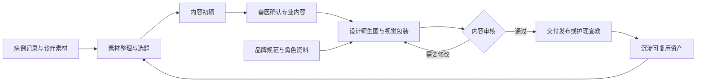

<div align="center">

# HiPaw · AIGC 内容生产中台

**面向连锁动物医院，连接病例素材、兽医专业内容与设计师创作。**

<p>
  
  
  
  
  
</p>

[项目介绍](#项目介绍) · [工作流程](#工作流程) · [功能特性](#功能特性) · [快速开始](#快速开始) · [后续规划](#后续规划)

</div>

---

## 项目介绍

连锁动物医院积累了大量病例影像、手术视频与诊疗记录，但素材分散，内容制作需要兽医与设计师反复沟通专业信息、核验医学表述并调整视觉呈现。使用通用 AIGC 工具时，专业背景与品牌要求仍需反复输入，已有素材难以持续复用。

**HiPaw 希望将这些环节组织成一条可追溯、可复用的内容生产流程。** 兽医负责专业内容与医学审核，设计师负责生图、编排与视觉包装，双方共享选题、素材和品牌资料，减少重复沟通与加工。

一期聚焦**口播视频及配套封面、科普插图**，后续拓展病例图文与护理宣教材料。产品目标是缩短内容交付时间、减少返工，并提高素材复用率与品牌一致性。

> **当前阶段：本地可运行原型。** 设计画布、图片上传、品牌资料保存和生图接口已实现；病例同步、自动脱敏、脚本生成、医学校对与视频粗剪仍为演示流程。真实生图需要配置 fal 账户，尚未完成真实模型效果验收。

### 面向谁

| 角色 | 在目标流程中的职责 | 当前支持情况 |
| --- | --- | --- |
| 护士 / 素材提供者 | 收集诊疗现场的照片、视频，关联病例 | 素材入库流程演示 |
| 兽医 | 确认专业事实、准备口播、审核医学表述与示意图 | 选题、口播与审核流程演示 |
| 设计师 | 取用素材、生图、排版、包装并保存作品 | 已接入真实画布与图片服务接口 |
| 运营 | 组织选题、排期、发布与复盘 | 后续规划 |

## 工作流程

下面展示目标业务流程；完整的医学审核与交付流转仍在迭代中。



目前可实际使用的图片创作流程：

**导入设计素材 → 填写画面描述 → 选择参考图与品牌规则 → 提交生图任务 → 将结果放回画布 → 保存为待审核素材。**

涉及具体病例的诊疗事实应以兽医确认的病例记录为准；一般科普中的专业表述也需要兽医确认。生成的示意图属于表达素材，不作为病例事实来源。

## 功能特性

| 能力 | 说明 | 当前状态 |
| --- | --- | --- |
| 资产库 | 筛选素材、点击卡片查看详情；设计图片可上传和保存 | 设计素材已实现；病例素材为示例 |
| 选题与口播 | 从病例或想法开始，演示脚本、校对、提词、粗剪及设计交接 | 流程原型 |
| 无限画布 | 图片导入、拖拽、缩放、编排、撤销与画布导出 | 已接入开源画布 |
| AI 图片生成 | 通过 fal 提交普通生图或参考图编辑任务，读取结果并放回画布 | 接口已实现，待真实账户联调 |
| 品牌资料复用 | 保存画风、避免事项、可选配色、Logo、字体与参考图 | 已实现本地保存 |
| 吉祥物配置 | 保存标准形象、固定特征、LoRA 权重地址与触发词 | 配置与调用接口已实现，待训练权重验证 |
| 生成记录 | 保存任务状态、实际提示词、品牌版本快照与返回的种子 | 已实现本地记录 |
| 作品审核状态 | 新作品默认待审核，可手动标记通过 | 已实现状态记录；完整审批权限待建设 |

页面采用**白色面板、浅灰画布和蓝色操作按钮**。桌面端将生图设置放在画布左侧，支持专注模式；资产详情保持点击打开弹窗。

### 品牌与吉祥物如何复用

- **文字规则：** 开启“应用品牌规范”后，将画风和避免事项加入本次生成提示词。
- **配色：** 默认不设置医院品牌色；需要时可指定创作参考配色。界面主题不会自动限制图片颜色。
- **参考素材：** Logo、品牌参考图和吉祥物标准图可从素材入口放入画布，再由设计师选择使用。
- **角色模型：** 开启吉祥物选项后，传入匹配基础模型的 LoRA、触发词和影响强度。
- **版本记录：** 生成任务保留提交时使用的品牌快照；之后修改品牌资料，不会改写旧任务的记录。

这里的“记忆”是**保存资料并在创作时复用**。上传参考图不会自动训练模型；文字规范也不等于自动品牌校验。Logo 与字体作为排版资料保存，当前不自动合成精确 Logo 或长段文字。

## 快速开始

### 环境要求

- Node.js **22.12+** 与 npm。
- Bun，用于安装画布的锁定依赖；也可使用下方 npm 替代命令。
- 现代浏览器。
- 真实生图需要可用的 fal API Key；仅查看原型、操作画布和保存品牌资料不需要密钥。

本地开发与构建已在 macOS、Node.js 24 环境验证。

### 1. 下载源码并安装画布依赖

下载本仓库源码，进入包含 `package.json` 的项目根目录，然后执行：

```bash
cd vendor/infinite-canvas/web
bun install --frozen-lockfile --ignore-scripts
cd ../../..
```

没有安装 Bun 时，可在 `vendor/infinite-canvas/web` 目录使用：

```bash
npm exec --yes --package=bun@1.4.2 -- bun install --frozen-lockfile --ignore-scripts
```

画布保留了上游的 Bun 锁定文件。上游 npm 锁定文件与依赖声明不完全同步，因此使用上述方式安装；根目录的本地服务没有额外运行依赖。

### 2. 构建画布并启动工作台

回到项目根目录执行：

```bash
npm run build:canvas
npm start
```

打开 [HiPaw 工作台](http://127.0.0.1:18766/hipaw-aigc-workbench.html#designer)。

需要通过本地服务访问，不能只双击 HTML 文件。画布构建产物不随源码提交，首次启动前需要先完成构建。

### 3. 配置生图服务

打开“品牌中心”，填写 fal API Key 并保存，再进入“设计画布”。保存密钥不产生生图费用，实际生成会使用 fal 账户额度。

也可以在项目根目录准备环境配置：

```bash
cp .env.example .env.local
```

编辑 `.env.local` 后重新启动服务：

```dotenv
FAL_KEY=
PORT=18766
```

| 配置项 | 作用 | 默认值 |
| --- | --- | --- |
| `FAL_KEY` | fal 服务密钥；留空时读取品牌中心保存的本地凭据 | 空 |
| `PORT` | 本地工作台端口 | `18766` |

启动时，环境变量中的 `FAL_KEY` 优先于本地凭据文件；运行期间在品牌中心重新保存密钥会立即生效。若同时使用两种方式，下次重启仍按启动时的优先级读取。

### 4. 配置吉祥物（可选）

在“品牌中心”填写标准形象、固定特征，以及训练好的 **FLUX.2 [dev] LoRA** 权重 HTTPS 地址、触发词和影响强度，然后到设计画布开启吉祥物选项。

当前仓库不包含训练服务、训练图片或 LoRA 权重。没有 LoRA 时仍可使用普通生图。训练可在外部平台完成，工作台负责保存配置和调用已训练模型。

## 技术栈

| 层 | 技术与职责 |
| --- | --- |
| 工作台界面 | HTML、CSS、JavaScript；承载资产库、选题、口播流程与品牌中心 |
| 设计画布 | 基于 `basketikun/infinite-canvas`；React 19、Vite 7、TypeScript、Ant Design、Tailwind CSS、Zustand |
| 本地服务 | Node.js 原生 HTTP 服务；提供品牌、图片、生成任务与素材接口 |
| 图片模型 | fal FLUX.2 LoRA 生图与参考图编辑接口 |
| 本机文件存储 | JSON 保存品牌、凭据、任务与素材元数据；文件目录保存图片 |
| 浏览器存储 | IndexedDB 保存画布项目与节点图片 |

画布以同源 iframe 嵌入工作台，通过消息交换导入图片和读取选中图片；fal 请求由本地服务发出，密钥不会传入画布。

## 目录结构

```text
outputs/                         # 工作台页面、交互和主题样式
server/
  index.mjs                      # 本地 HTTP 服务与 API
  brand.mjs                      # 品牌校验与生图参数组装
tests/                           # 本地服务测试，使用模拟 fal
vendor/infinite-canvas/           # 开源画布源码与上游许可证
  web/                           # 画布应用
    dist/                        # 本地构建产物，已忽略
docs/
  visual-guidelines.md           # 白色主题与界面约定
data/                            # 运行时生成，已忽略
  brand.json                     # 品牌资料
  credentials.json               # 本地 fal 凭据
  jobs.json                      # 生成记录
  assets.json                    # 素材元数据
  media/                         # 上传及生成图片
.env.example                     # 环境变量示例
package.json                     # 启动、构建与测试命令
README.md                        # 项目说明
```

品牌与作品保存在本机文件中；画布保存在当前浏览器中，可导出备份。当前没有团队云同步，更换浏览器或清理浏览器数据会影响画布的可用性。

## 本地 API

<details>
<summary>展开接口列表</summary>

| 方法 | 路径 | 说明 |
| --- | --- | --- |
| GET | `/api/health` | 服务与配置状态 |
| GET / PUT | `/api/brand` | 读取、保存品牌资料；保存时更新版本 |
| PUT | `/api/credentials` | 保存 fal 密钥，不回显密钥 |
| POST | `/api/uploads` | 上传 PNG / JPG / WEBP 图片，请求体为文件二进制 |
| GET / POST | `/api/assets` | 读取素材或保存设计图片 |
| PATCH | `/api/assets/{id}` | 更新 `pending_review` / `approved` 状态 |
| POST | `/api/generate` | 提交生成任务，返回任务记录 |
| GET | `/api/jobs` | 读取生成历史 |
| GET | `/api/jobs/{id}` | 读取任务状态，必要时查询远端结果 |
| DELETE | `/api/jobs/{id}` | 请求取消排队中或生成中的任务 |

除图片上传外，写入接口使用 JSON。错误返回形式为 `{"error":"错误说明"}`。

当前一次支持生成 1–4 张图片，最多使用 4 张参考图；单张上传图片不超过 20MB。支持的画面比例为 `1:1`、`3:4`、`4:3`、`16:9`、`9:16`。

生成任务可从记录中继续读取或请求取消；程序不会自动重复提交付费生成请求。取消结果及计费仍取决于服务方的任务状态。

</details>

## 开发与验证

在项目根目录执行：

```bash
# 本地服务测试：模拟 fal，不消耗生图额度
npm test

# 画布类型检查
npm --prefix vendor/infinite-canvas/web run typecheck

# 修改画布源码后重新构建
npm run build:canvas
```

已完成静态构建、类型检查、页面资源检查及 6 项本地服务测试，覆盖品牌保存、空配色、密钥隔离、LoRA 参数、生成结果保存和品牌版本快照。

浏览器视觉与完整操作流程仍待验收；真实生图质量、角色一致性和医学准确性尚未验证。

## 当前边界

- **本地原型：** 服务监听 `127.0.0.1`。界面中的身份切换用于演示，不代表已实现登录、角色权限或多人审批。
- **专业内容：** 病例、自动识别、脱敏和口播示例用于说明产品流程，目前没有连接医院真实业务系统。
- **数据流向：** 发起生图时，画面描述、选用的品牌规则和参考图片会发送给 fal；“本地运行”不代表模型推理也在本机完成。
- **密钥保存：** 密钥保存在本机文件或环境变量中，接口不返回明文；本地凭据文件限制为当前系统用户读写，不是加密存储。
- **GitHub 上传：** `.gitignore` 已排除 `data/`、`.env.local`、依赖与构建产物。真实病例、私人品牌资料、训练图片和模型权重不应作为公开示例上传；网页手动上传也需要自行避开这些文件。

## 后续规划

- [x] 接入无限画布，并与工作台交换图片。
- [x] 支持品牌资料、角色配置与生成记录的本地保存。
- [x] 实现普通生图、参考图编辑及 LoRA 调用接口。
- [x] 实现设计作品入库与待审核状态记录。
- [ ] 完成真实 fal 账户与吉祥物 LoRA 的效果验证。
- [ ] 接入结构化病例、素材识别与院内脱敏流程。
- [ ] 实现脚本生成、兽医审核和设计交接的完整流程。
- [ ] 完善品牌校验、多尺寸输出与护理宣教模板。
- [ ] 增加团队账号、权限、共享存储与审核记录。
- [ ] 支持运营排期、发布衔接与内容效果复盘。


[查看视觉规范](docs/visual-guidelines.md) · [查看本地服务](server/index.mjs) · [查看测试](tests/workbench.test.mjs)
